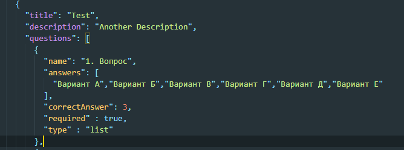

Задача от <a href="http://intas-company.com/">ИНТАС</a>
Необходимо написать приложение, позволяющее из списка доступных тестов, выполнять их,
а по завершению выполнения, узнать результаты и просмотреть правильные/неправильные варианты ответов.

Требования к вёрстке:
– Кроссбраузерно, обязательно поддержка IE 11.
– Адаптивно.
– БЭМ.
– Семантически правильная вёрстка (каждый html-элемент используется осмысленно и по назначению).
– Препроцессоры для стилей, предпочтительнее SCSS.
– По возможности шаблонизаторы (pugjs).
– Шрифты можно использовать с cdn.

Требования к JavaScript:
– Без использования jQuery и прочих сторонних библиотек;
– ES6 и выше с транспиляцией в ES5;
– работоспособность приложения в IE11;
– localStorage/sessionStorage.

<a href="https://osdnyasha.github.io/intas/">online demo</a>

Тесты в формате JSON

required - для обьязательных вопросов
type - выбор стилизации
